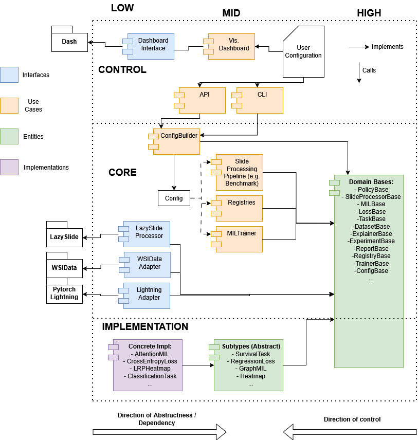

PathBench 2.0
=============

**PathBench-MIL** is a modular benchmarking framework for multiple instance
learning (MIL) in computational pathology. It supports whole-slide image (WSI)
feature extraction, H5 artifact generation, tile overview reports, MIL
benchmarking, hyperparameter optimization, optional TorchMIL backends, metric
adapters, and explainability hooks.

PathBench follows a Clean Architecture: policies and trainers resolve
implementations through PathBench interfaces and registries, while concrete
third-party packages live in adapter modules.

----

.. toctree::
   :maxdepth: 1
   :caption: Getting Started

   installation
   quickstart

.. toctree::
   :maxdepth: 2
   :caption: Tutorials

   tutorials/index

.. toctree::
   :maxdepth: 1
   :caption: Reference

   configuration
   testing
   backends
   architecture
   troubleshooting

.. toctree::
   :maxdepth: 1
   :caption: API Reference

   api/index

----

Key Capabilities
----------------

.. list-table::
   :widths: 30 70
   :header-rows: 1

   * - Feature
     - Description
   * - Feature extraction
     - Tile WSIs, segment tissue, extract tile features, persist row-aligned H5 artifacts.
   * - Benchmarking
     - Grid-search over model, loss, feature extractor, activation, and optimizer combinations.
   * - Optimization
     - Optuna-driven hyperparameter search with configurable samplers and pruners.
   * - Inference
     - Checkpoint-based prediction and per-instance attention heatmap generation.
   * - Backends
     - Native PathBench MIL models *or* TorchMIL via one generic adapter.
   * - Metrics/losses
     - Optional TorchMetrics (classification) and TorchSurv (survival) integrations.
   * - Explainability
     - Per-instance MIL attention heatmaps stored alongside slide H5 artifacts.
   * - TCGA integration
     - Direct dataset download via ``tcga-tools``, auto-generated annotation CSVs.
